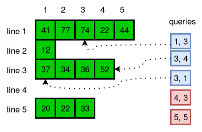

# Programming 2 - Lab 6

This template repository is the starter project for Programming 2 Lab 6. Written in Java, and tested with Gradle/JUnit.

### Question(s)

Sometimes it's better to use dynamic size arrays. Java's Arraylist can provide you this feature. Try to solve this problem using Arraylist. You are given n lines. In each line there are zero or more integers. You need to answer a few queries where you need to tell the number located in yth position of xth line.

Input Format

The first line has an integer n. In each of the next n lines there will be an integer d denoting number of integers on that line and then there will be d space-separated integers. In the next line there will be an integer q denoting number of queries. Each query will consist of two integers x and y.

Output Format

In each line, output the number located in yth position of xth line. If there is no such position, just print "ERROR!"

Sample Input

5  
5 41 77 74 22 44  
1 12  
4 37 34 36 52  
0  
3 20 22 33  
5  
1 3  
3 4  
3 1  
4 3  
5 5

Sample Output

74  
52  
37  
ERROR!  
ERROR!

Constraints

1 <= n <= 20000  
0 <= d <= 50000  
1 <= q <= 1000  
1 <= x, y <= n

### Setup Command

`gradle clean`

### Run Command

`gradle test`
